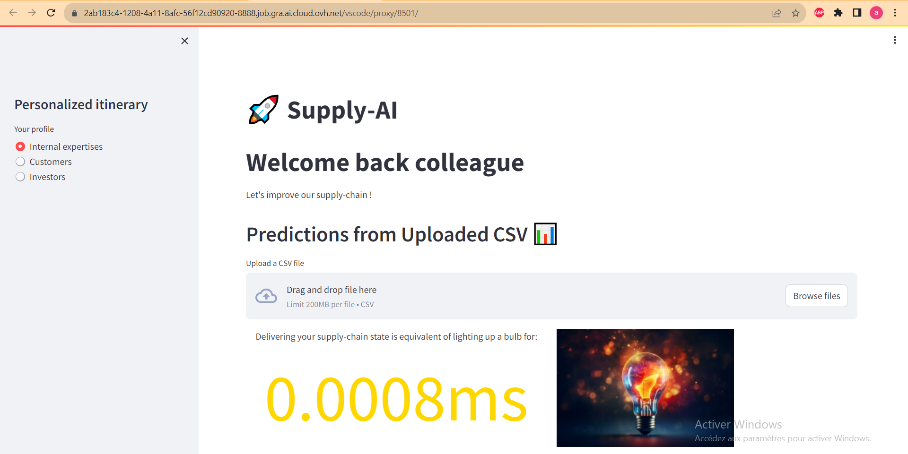

# Hickathon_4
- We present you Supply-AI 🚀, a fully deployed model that aims to create a reliable bond between Schneider Electric and their customers. It collects the demand, predicts the ressources required to honor the order. It also informs the client about the certainty to be delivered on time. Finally, it assess the carbon footprint induced by the order and by the numeric model itself and compare it as consumption of ordinary goods.

## 1 Overview

The App contains three sections that allows flexibility in the degree of technical expertise you wish to pass on. 
- Internal expertises: Be as precise as possible with figures of the whole company history.
- Customers: Provide supply-chain information according his demand so that we can create a relationship of trust.
- Investors: Provide indides of how well perform the company.

There is a drag-and-drop spape which allows the user to simulate the supply-chain response to different scenarios. All outputs are presented bellow with interactive plots and downloadable dataframes. 

The carbon emission is indicated compared to lighting time of a bulb so that everyone can figure it out whether it is important or not.

## 2 Project Management
### Data Understanding

### Data Preprocessing 

### Modeling Development
_In this section, explain your scientific contribution. What is your contribution, what ideas are you proud of, what do you want to highlight? How do you justify the accuracy you've achieved?_

### Deployment Strategy

## 3 Sales Forecasting and Sustainability

## 4 Conclusion